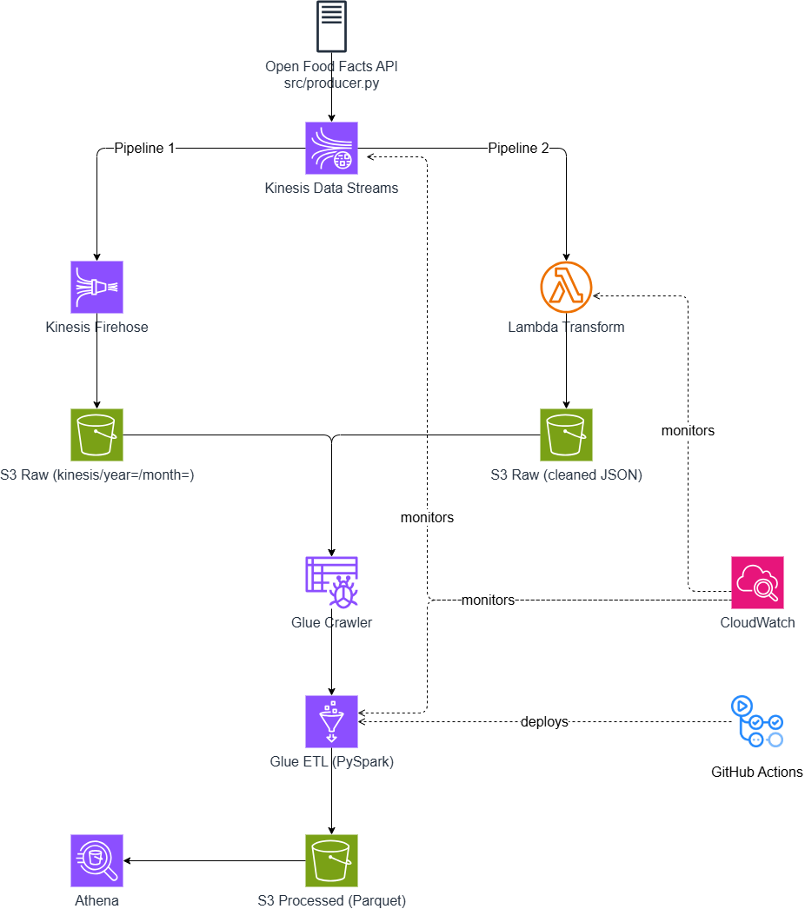

# nutri-stream-lakehouse

> Real-time food data pipeline built on AWS — ingesting, transforming, and analyzing French food products from Open Food Facts.


---

## Architecture



```
Open Food Facts API (🇫🇷)
    → Kinesis Data Streams        (real-time streaming)
    → Lambda                      (stream transformation)
    → Kinesis Firehose → S3 raw   (data lake ingestion)
    → Glue Crawler + ETL          (batch transformation)
    → S3 processed (Parquet)      (optimized storage)
    → Athena                      (SQL queries)
    → QuickSight                  (dashboard)
    → CloudWatch                  (monitoring & alerts)
```

---

## Stack

| Layer | Service |
|---|---|
| Streaming | AWS Kinesis Data Streams |
| Delivery | AWS Kinesis Firehose |
| Transformation | AWS Lambda (Python) + AWS Glue (PySpark) |
| Storage | AWS S3 (raw + processed) |
| Query | AWS Athena |
| Visualization | AWS QuickSight |
| Monitoring | AWS CloudWatch |
| IaC | Terraform |

---

## Project Structure

```
nutri-stream-lakehouse/
├── terraform/
│   ├── cloudwatch.tf
│   ├── cloudwatch_dashboards.tf
│   ├── provider.tf
│   ├── s3.tf
│   ├── kinesis.tf
│   ├── lambda.tf
│   ├── glue.tf
│   ├── athena.tf
│   ├── iam_roles.tf
│   └── variables.tf
├── src/
│   ├── producer.py          # Kinesis producer — Open Food Facts API
│   ├── lambda_transform.py  # Stream transformation
│   └── glue_etl.py          # Batch ETL — PySpark
├── docs/
│   ├── architecture.png
│   ├── athena_queries.sql
│   ├── Nutriscore_dashboard.jpg
│   └── CloudWatch_dashboards.jpg
└── README.md
```

---

## Getting Started

### Prerequisites

- AWS account with a billing alarm configured
- AWS CLI installed and configured (`aws configure`)
- AWS IAM user with the following permissions: `AmazonKinesisFullAccess`, `AWSLambda_FullAccess`, `AWSGlueConsoleFullAccess`, `AmazonS3FullAccess`, `AmazonAthenaFullAccess`, `CloudWatchFullAccessV2`, `IAMFullAccess`
- Terraform >= 1.6
- Python >= 3.11
- GitHub account (for CI/CD with GitHub Actions)

> **Note:** QuickSight must be enabled manually in the AWS Console before running the pipeline. Go to AWS Console → QuickSight → Sign up for QuickSight (Standard edition is enough).

---

### 1. Clone the repo

```bash
git clone https://github.com/victornaya-dev/nutri-stream-lakehouse.git
cd nutri-stream-lakehouse
```

### 2. Package the Lambda function

```bash
cd src
zip lambda_transform.zip lambda_transform.py
cd ..
```

> **Required before `terraform apply`** — Terraform looks for this `.zip` file when deploying Lambda.

### 3. Configure Terraform variables

Create a `terraform/terraform.tfvars` file with your own values (never commit this file):

```hcl
kinesis_stream_arn = "arn:aws:kinesis:eu-west-1:YOUR_ACCOUNT_ID:stream/food-facts-stream"
```

This file is ignored by git — see `.gitignore`.

### 4. Deploy infrastructure

```bash
cd terraform
terraform init
terraform plan
terraform apply
```

### 5. Run the producer

Open a new terminal and run:

```bash
pip install boto3 requests
python src/producer.py
```

Wait ~2 minutes until you see logs like:

```
Enviado: Danette Chocolat
Enviado: Evian
10 productos enviados. Esperando 30s...
```

### 6. Run the Glue pipeline

Once the producer has sent at least one batch, run the crawler and ETL job in order:

```bash
# 1. Crawl raw JSON files
aws glue start-crawler --name food-facts-crawler

# 2. Wait ~1-2 min until the crawler finishes, then run the ETL
aws glue start-job-run --job-name food-facts-etl

# 3. Crawl the processed Parquet files
aws glue start-crawler --name food-facts-parquet-crawler
```

### 7. Query with Athena

Once the second crawler finishes, open AWS Console → Athena and run:

```sql
SELECT nutriscore_grade, COUNT(*) as total
FROM food_facts_db.parquet
GROUP BY nutriscore_grade
ORDER BY total DESC;
```

More queries available in `docs/athena_queries.sql`.

### 8. Tear down

When you're done, destroy all resources to avoid ongoing charges:

```bash
cd terraform
terraform destroy
```

---

## Cost Estimate

This project is designed to be cheap to reproduce. Estimated cost for a full end-to-end run:

| Service | Cost |
|---|---|
| Kinesis Data Streams (1 shard) | ~$0.015/hour |
| Lambda | Virtually free at this volume |
| Kinesis Firehose | ~$0.029 per GB delivered |
| Glue ETL job (G.1X, ~5 min run) | ~$0.44 per run |
| S3 (raw + processed) | Cents |
| Athena | $5 per TB scanned (Parquet = nearly zero) |
| CloudWatch | Free tier covers this |

> **Estimated total to reproduce this project end-to-end: < $5**
>
> The main ongoing cost is Kinesis (~$0.36/day) when left running idle. Stop the producer and run `terraform destroy` when you're done.

---

## CI/CD

Every push to `main` triggers GitHub Actions:
- Zips and deploys Lambda automatically
- Runs `terraform apply` for infrastructure changes

### Setup

Add these secrets in GitHub → Settings → Secrets and variables → Actions:

```
AWS_ACCESS_KEY_ID
AWS_SECRET_ACCESS_KEY
AWS_REGION
AWS_ACCOUNT_ID
KINESIS_STREAM_ARN
FIREHOSE_ROLE_ARN
BUCKET_RAW
BUCKET_PROCESSED
```

### Branches

- `main` → production, auto-deploy via GitHub Actions
- `develop` → development, manual deploy with `terraform apply`

---

## Dashboard

QuickSight dashboard showing:
- Nutriscore distribution (pie chart)
- Sugar vs Fat by Nutriscore (scatter plot)
- Top 10 brands by product count
- Average nutrients (sugar, fat, salt) by Nutriscore grade

> QuickSight dashboards are account-bound and cannot be exported.
> To reproduce: run `producer.py` to ingest data, then recreate the
> visualizations in your own QuickSight account using the Athena dataset.


---

## Monitoring

CloudWatch dashboard showing:
- Lambda invocations & errors (food-facts-transform)
- Lambda duration
- Kinesis incoming records (food-facts-stream)
- Glue job elapsed time (food-facts-etl)

> Dashboard imported into Terraform — see `terraform/cloudwatch_dashboards.tf`


---

## Dataset

| Source | Records | Period |
|---|---|---|
| Open Food Facts API | 171 products | June 2026 |

> Full dataset: [world.openfoodfacts.org](https://world.openfoodfacts.org/)

---

## Build Log — 2026

| Week | Focus | Status |
|---|---|---|
| Week 1 | S3 + Kinesis + Python producer | ✅ Done |
| Week 2 | Lambda (JSON normalize) + Firehose → S3 | ✅ Done |
| Week 3 | Glue ETL → Parquet + Athena queries | ✅ Done |
| Week 4 | QuickSight + CloudWatch + CI/CD + docs | ✅ Done |

---

## Author

**Victor Naya** —
[](https://github.com/victornaya-dev)

Built as a portfolio project for the AWS Certified Data Engineer Associate (DEA-C01).

---

## License

MIT
