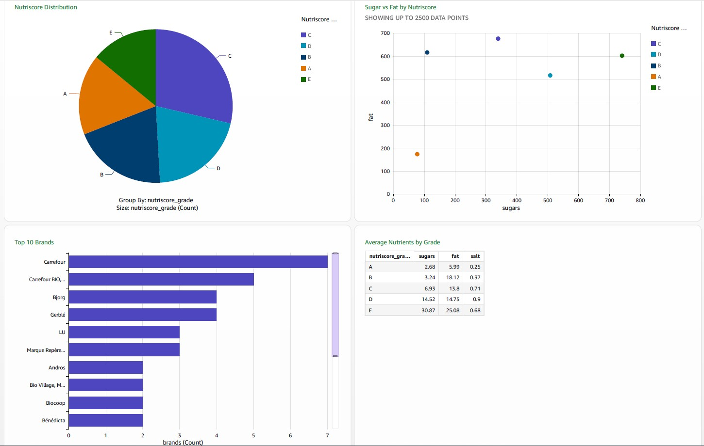
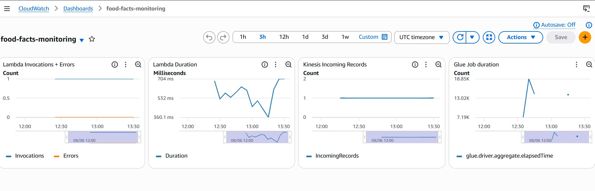

# nutri-stream-lakehouse

> Real-time food data pipeline built on AWS — ingesting, transforming, and analyzing French food products from Open Food Facts.


---

## Architecture

```
Open Food Facts API (🇫🇷)
    → Kinesis Data Streams        (real-time streaming)
    → Lambda                      (stream transformation)
    → Kinesis Firehose → S3 raw   (data lake ingestion)
    → Glue Crawler + ETL          (batch transformation)
    → S3 processed (Parquet)      (optimized storage)
    → Athena                      (SQL queries)
    → QuickSight                  (dashboard)
    → CloudWatch                  (monitoring & alerts)
```

>  Architecture diagram coming in Week 4

---

##  Stack

| Layer | Service |
|---|---|
| Streaming | AWS Kinesis Data Streams |
| Delivery | AWS Kinesis Firehose |
| Transformation | AWS Lambda (Python) + AWS Glue (PySpark) |
| Storage | AWS S3 (raw + processed) |
| Query | AWS Athena |
| Visualization | AWS QuickSight |
| Monitoring | AWS CloudWatch |
| IaC | Terraform |

---

## 📁 Project Structure

```
nutri-stream-lakehouse/
├── terraform/
│   ├── cloudwatch.tf
│   ├── cloudwatch_dashboards.tf
│   ├── provider.tf
│   ├── s3.tf
│   ├── kinesis.tf
│   ├── lambda.tf
│   ├── glue.tf
│   ├── athena.tf
│   ├── iam_roles.tf
│   ├── variables.tf
├── src/
│   ├── producer.py          # Kinesis producer — Open Food Facts API
│   ├── lambda_transform.py  # Stream transformation
│   └── glue_etl.py          # Batch ETL — PySpark
├── docs/
│   └── architecture.png
│   └── athena_queries.sql
│   └── Nutriscore_dashboard.jpg
└── README.md
```

---

##  Getting Started

### Prerequisites

- AWS account with billing alarm configured
- AWS CLI installed and configured (`aws configure`)
- AWS IAM user with permissions: Lambda, Kinesis, S3, IAM, CloudWatch, Glue, Athena, QuickSight
- Terraform >= 1.6
- Python >= 3.11
- GitHub account (for CI/CD with GitHub Actions)

## Configuration

Create a `terraform/terraform.tfvars` file with your own values (never commit this file):

```hcl
kinesis_stream_arn = "arn:aws:kinesis:eu-west-1:YOUR_ACCOUNT_ID:stream/food-facts-stream"
```

This file is ignored by git — see `.gitignore`.


### Deploy infrastructure

```bash
cd terraform
terraform init
terraform plan
terraform apply
```

## CI/CD

Every push to `main` triggers GitHub Actions:
- Zips and deploys Lambda automatically
- Runs `terraform apply` for infrastructure changes

### Setup
Add these secrets in GitHub → Settings → Secrets:
    AWS_ACCESS_KEY_ID
    AWS_SECRET_ACCESS_KEY
    AWS_ACCOUNT_ID
    KINESIS_STREAM_ARN
    FIREHOSE_ROLE_ARN
    BUCKET_RAW
    BUCKET_PROCESSED
    
### Branches
- `main` → production, auto-deploy via GitHub Actions
- `develop` → development, manual deploy with `terraform apply`

### Run the producer

```bash
pip install boto3 requests
python src/producer.py
```

---

## Dashboard

QuickSight dashboard showing:
- Top 10 brands ingested in real time
- Product distribution by category (dairy, beverages, snacks...)
- Average sugar/fat/salt levels by category
- Nutri-Score A vs E distribution

> QuickSight dashboards are account-bound and cannot be exported.
> To reproduce: run `producer.py` to ingest data, then recreate the
> visualizations in your own QuickSight account using the Athena dataset.



---

## Monitoring

CloudWatch dashboard showing:
- Lambda invocations & errors (food-facts-transform)
- Lambda duration
- Kinesis incoming records (food-facts-stream)
- Glue job elapsed time (food-facts-etl)

> Dashboard imported into Terraform — see `terraform/cloudwatch_dashboards.tf`



## Dataset

Sample dataset used for this demo:

| Source | Records | Period |
|---|---|---|
| Open Food Facts API | 171 products | June 2025 |

> Full dataset: [world.openfoodfacts.org](https://world.openfoodfacts.org/)

---

## Build Log

| Week | Focus | Status |
|---|---|---|
| Week 1 | S3 + Kinesis + Python producer | ✅ Done |
| Week 2 | Lambda (JSON normalize) + Firehose → S3 | ✅ Done |
| Week 3 | Glue ETL → Parquet + Athena queries | ✅ Done |
| Week 4 | QuickSight + CloudWatch + CI/CD + docs | 🔄 In progress |

---

## Related Article

*"Building a real-time food data pipeline with AWS Kinesis, Glue and Terraform"*
→ Published on Medium *(coming soon)*

---

##  Author

**Victor Naya** —
[](https://github.com/victornaya-dev)

Built as a portfolio project for the AWS Certified Data Engineer Associate (DEA-C01).

---

## License

MIT
